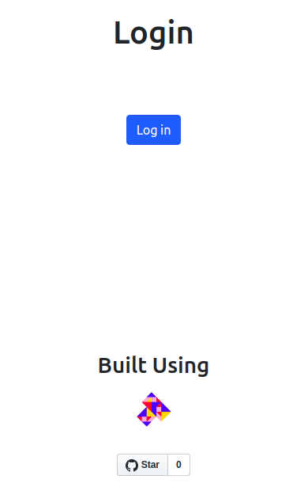
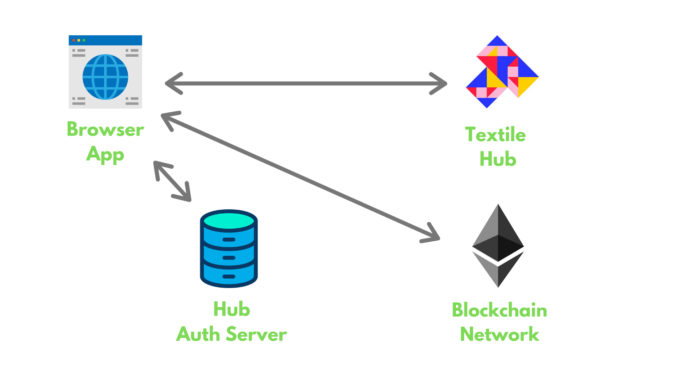

# Meme Marketplace Tutorial

## Status

This repository is in a **frozen** state. It is not being maintained or kept in sync with the libraries it depends on. Even though work on this repository has been **shelved**, anyone interested in updating or maintaining this library should express their interest on one Filecoin community conversation mediums: <https://github.com/filecoin-project/community#join-the-community>.

---

- [Overview](#overview)
- [App Architecture Overview](#app-architecture-overview)
- [How to run](#how-to-run)
- [License](#license)

## Overview

In this tutorial, we will build a meme marketplace using Textile Hub and Ethereum ERC 721 standard.

You will be able to upload memes to Textile Hub using a dashboard and register the memes with ERC 721 Non-fungible tokens, which will help anyone to uniquely identify the memes and their owners in a decentralized way!

After completing this tutorial, you will be able to:

- Write and deploy a ERC 721 standard contract to create and issue Non-fungible tokens (NFTs).
- Use javascript libraries to connect to remote Textile Hub to add and retrieve data from Textile Buckets.
- Use javascript libraries to connect to ethereum blockchain to interact with the deployed smart contract.

Here is a sneak-peek of how the final application will look:

**Login**

**Create Meme**

**Meme Marketplace**

## App Architecture Overview

Below is the 10,000 feet overview of how our application will work:

- Textile Hub is hosted on a remote server.
- The ERC 721 standard token contract lives on a local (or remote) blockchain network.
- A Textile hub authentication server runs locally.
- Your browser application interacts with the remote Textile hub server, local authentication server, the blockchain network for storing memes and creating NFTs, respectively.

## How to run

Follow [this tutorial]() on Filecoin docs to get started.

## License

This is dual-licensed under Apache 2.0 and MIT terms:

- Apache License, Version 2.0, ([LICENSE-APACHE](./LICENSE-APACHE) or http://www.apache.org/licenses/LICENSE-2.0)
- MIT license ([LICENSE-MIT](./LICENSE-MIT) or http://opensource.org/licenses/MIT)
